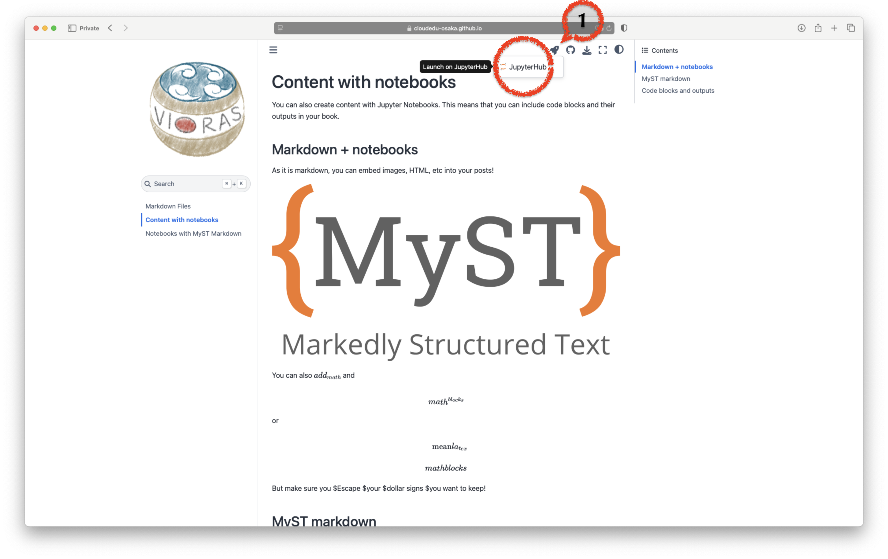
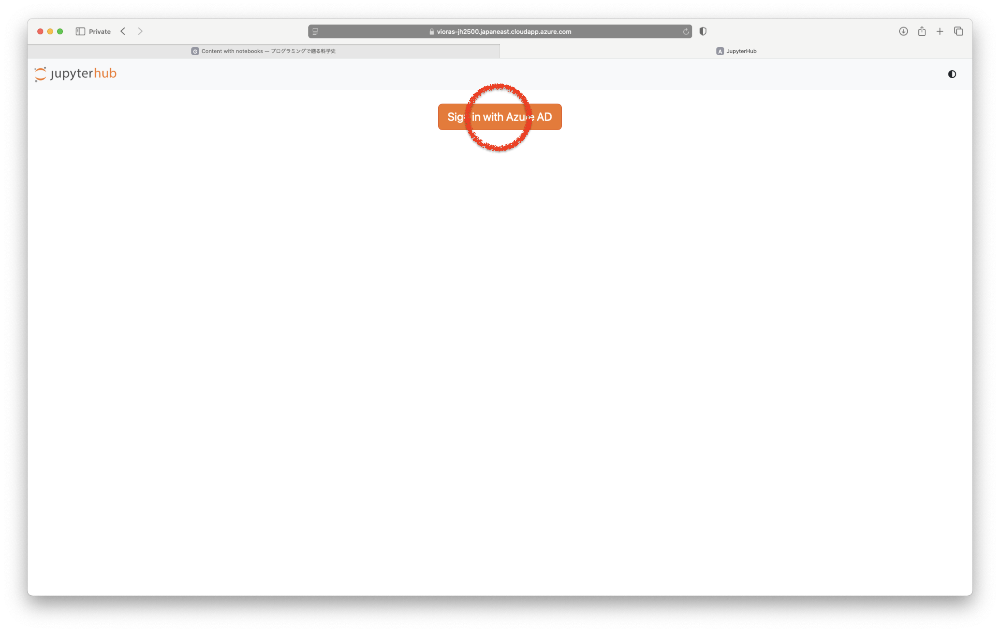
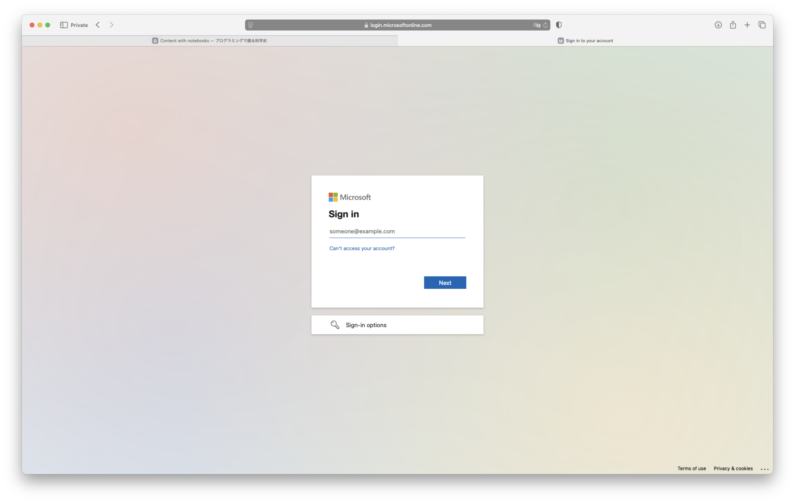
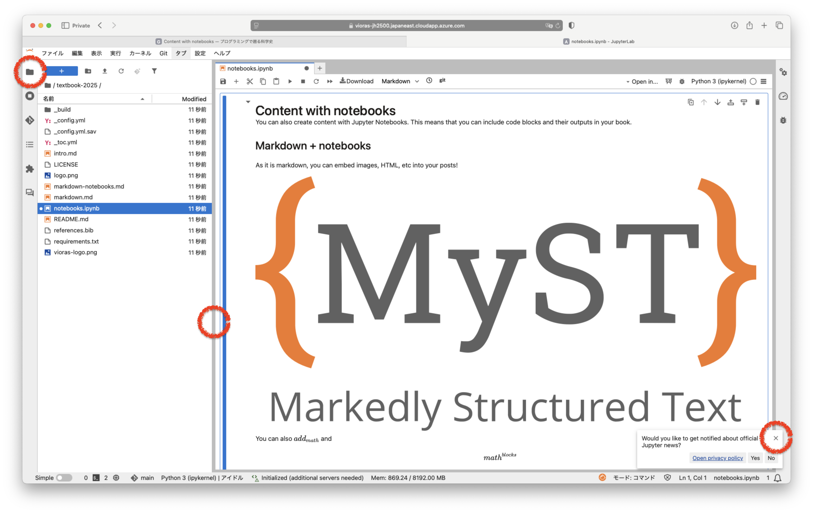

# 第一回
## 1.1 JupyterHub
### 1.1 CLE (Blackboard Learn) からJupyterBookへ

### 1.2 JupyterBookからJupyterHubへ

:::{figure}
:width: 60%

:::

### 1.3 JupytertHubへのログイン

* OUMailアカウントでログインします
    * 例: `u999999x@ecs.osaka-u.ac.jp`
    * 多要素認証が必要です

:::{figure}
:scale: 60%

:::

:::{figure}
:scale: 60%

:::

### 1.4 JupyterHubの使い方

* 情報社会基礎、情報科学基礎で起動したものと同じ仕組みです
    * Python以外のプログラミング言語が使えます
    * 対話型AIが使えます

:::{figure}
:scale: 60%

:::


```python

```
