# 第一回
## 1.3 GeoGebraで円を描く
### 1.3.1 GeoGebra

* [GeoGebra - Wikipedia](https://en.wikipedia.org/wiki/GeoGebra)
    * [GeoGebra Manual :: GeoGebra Manual](https://geogebra.github.io/docs/manual/en/)

### 1.3.2 起動

* [GeoGebra - the world’s favorite, free math tools used by over 100 million students and teachers](https://www.geogebra.org/)

:::{figure}
:scale: 60%

:::

:::{figure}
:scale: 60%
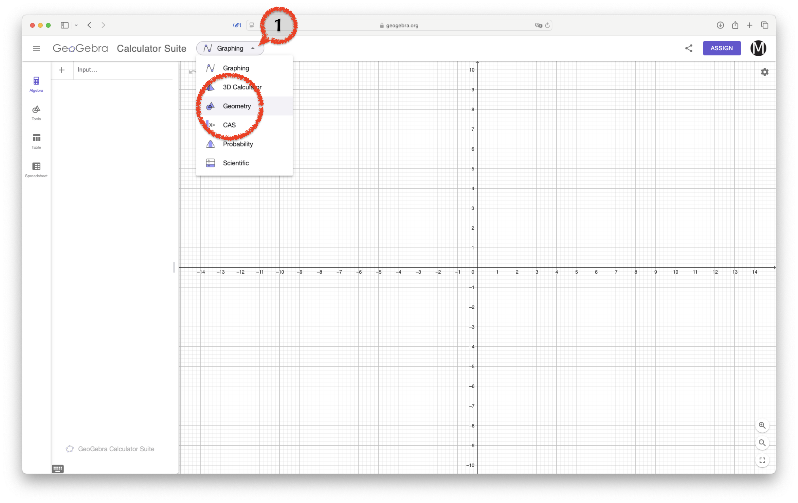
:::

:::{figure}
:scale: 60%
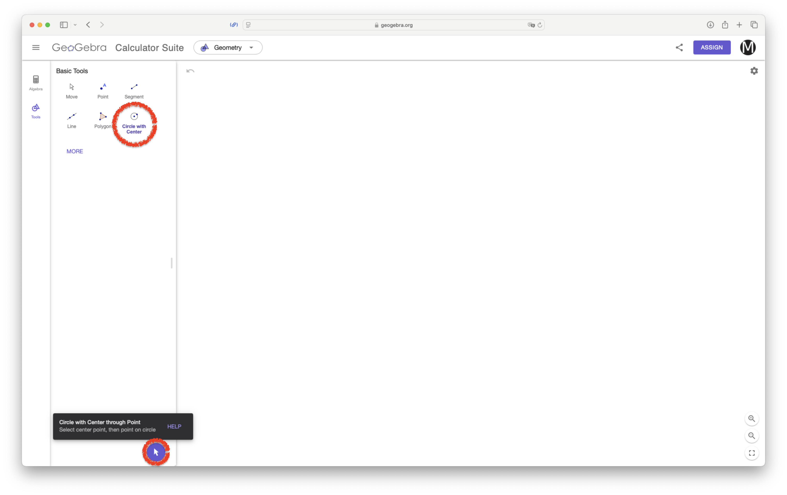
:::

:::{figure}
:scale: 60%
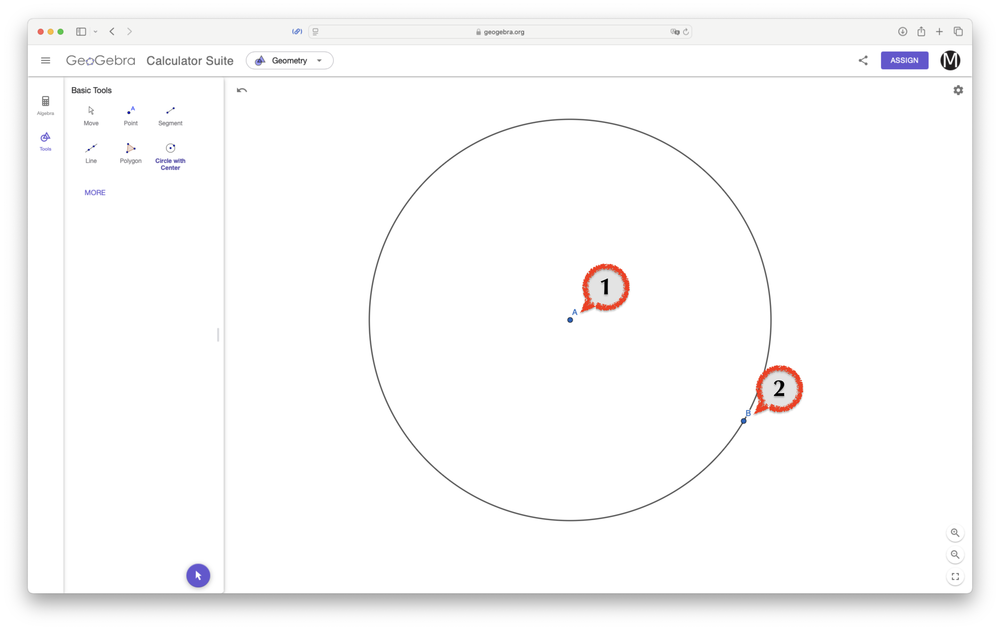
:::

### 1.3.2 設定

* この授業ではクラウドのアカウントは不要です

:::{figure}
:scale: 60%
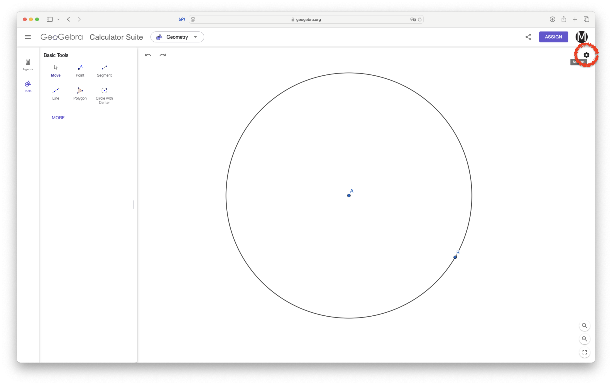
:::

* 座標軸 (Axes) やグリッド (Grid) は表示しません

:::{figure}
:scale: 60%
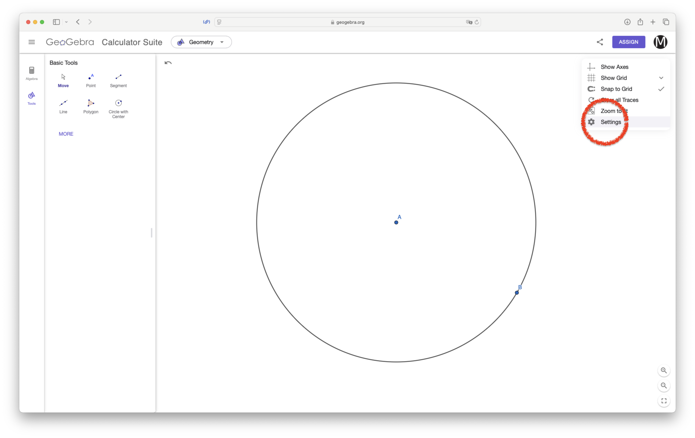
:::

* 英語 (English (US))

:::{figure}
:scale: 60%
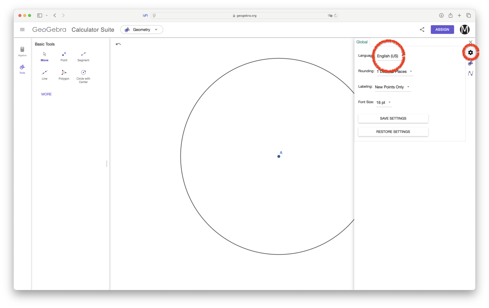
:::

* "Navitagion Bar for Construction Steps"

:::{figure}
:scale: 60%
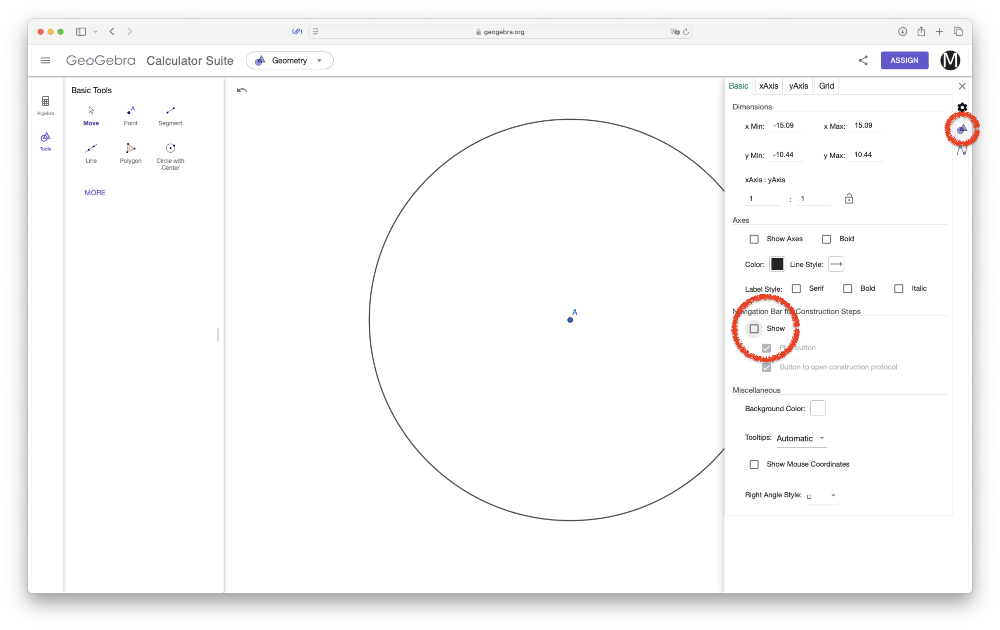
:::

* "Algebra Descriptions" で "Definition & Value" を選択

:::{figure}
:scale: 60%
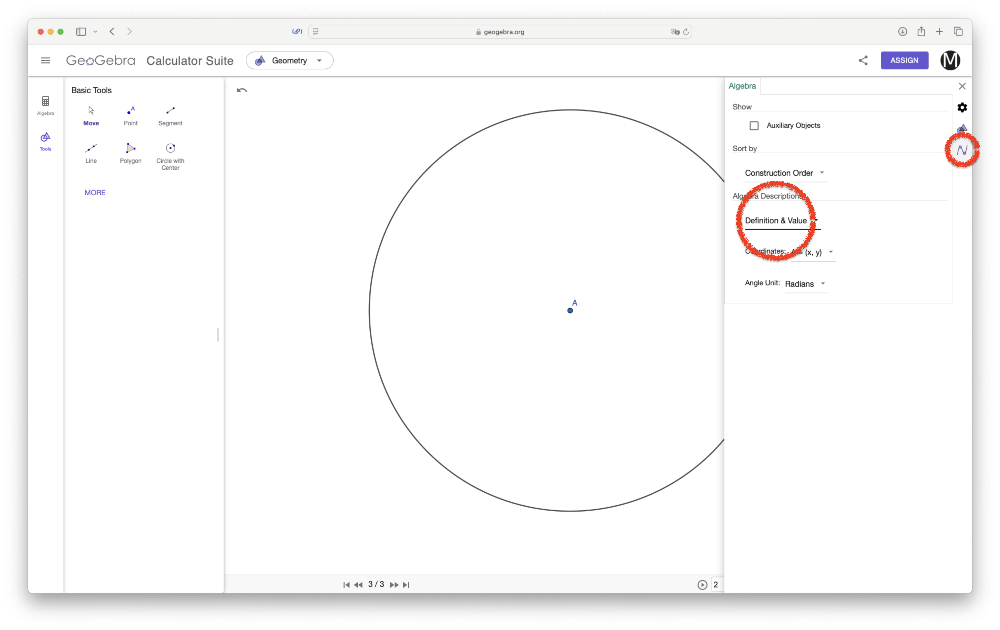
:::

* 右下から "Construction Protocol" を選択

:::{figure}
:scale: 60%
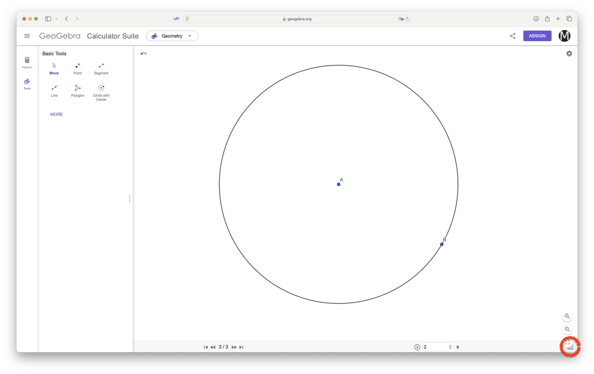
:::

:::{figure}
:scale: 60%
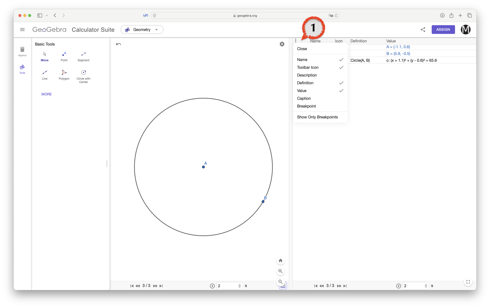
:::

### 1.3.3 代数 (Algebra) モード

:::{figure}
:scale: 60%
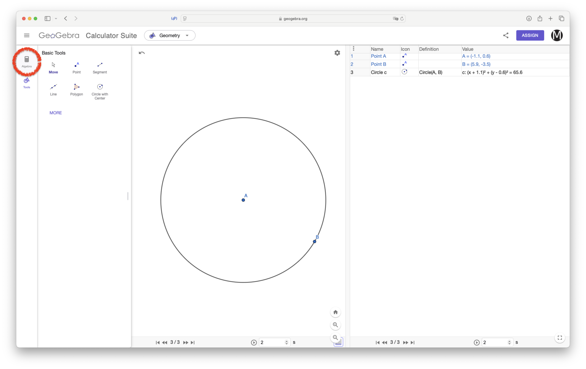
:::

:::{figure}
:scale: 60%

:::

$x^2+y^2=1$と入力

* `x`, `^`, `2`, 右矢印 (`→`), `y`, `^`, `2`, 右矢印 (`→`), `=`, `1`
* ちなみに下付文字は `_`

### 1.3.4 保存

:::{figure}
:scale: 60%
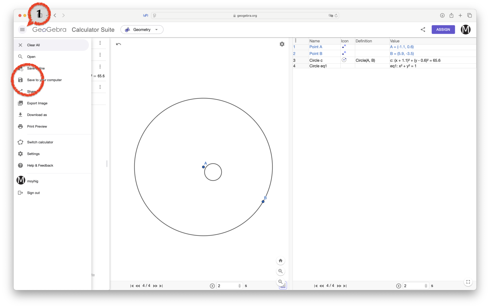
:::


```python

```
